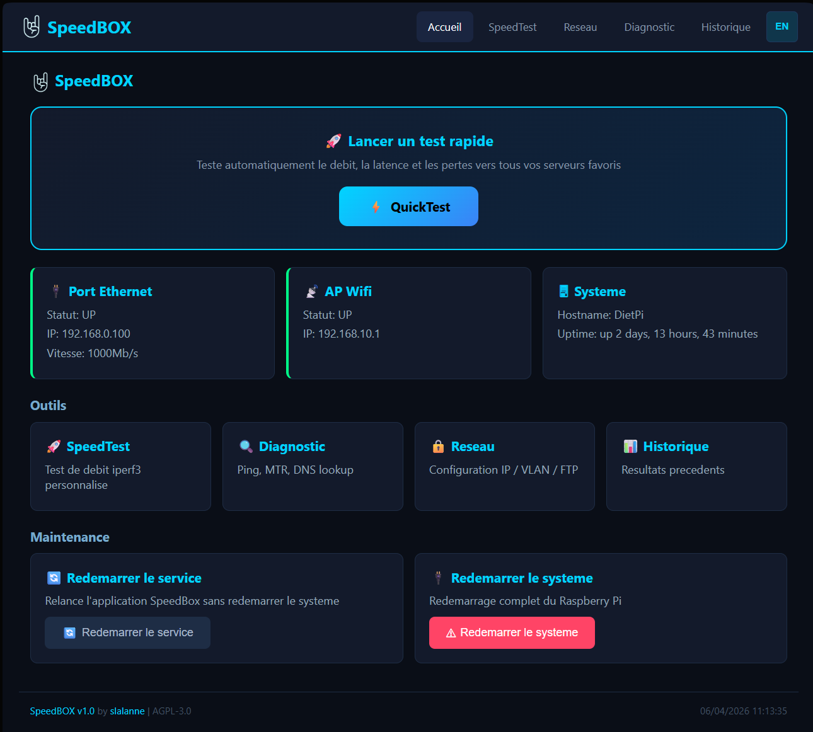
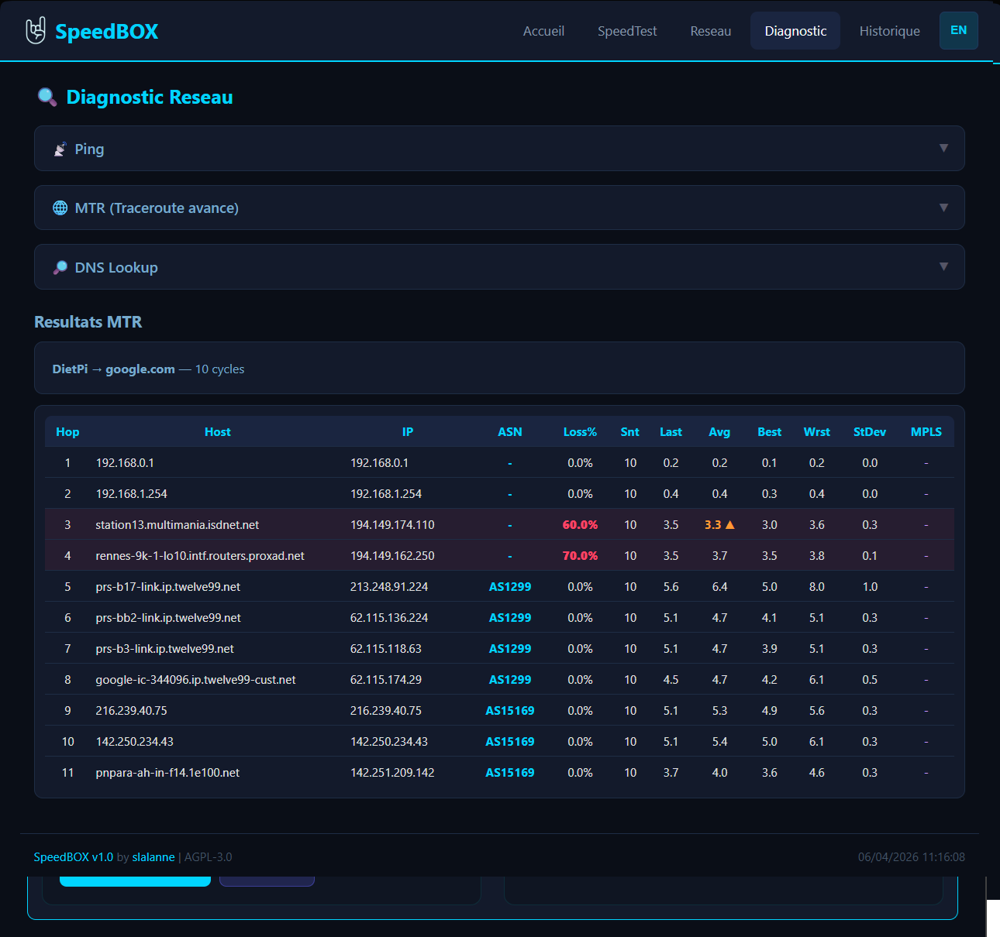

# SpeedBox

> Application web de test reseau et diagnostic pour Raspberry Pi
> *Network speed testing & diagnostics web app for Raspberry Pi*

[](LICENSE)
[](https://python.org)
[](https://www.raspberrypi.com/)
[](#)



---

## Fonctionnalites / Features

- **Tests de debit / Speed Tests** -- iperf3 TCP/UDP, upload/download, multi-stream, serveurs publics et prives
- **QuickTest** -- Sequence automatisee : MTR + UDP + TCP mono + TCP multi par serveur favori
- **Diagnostics reseau / Network Diagnostics** -- MTR (avec analyse par hop, detection de spikes), Ping temps reel, DNS lookup
- **Configuration reseau / Network Config** -- IP statique/DHCP, gestion VLAN, affichage status interfaces
- **Export FTP/SFTP** -- Envoi des resultats vers un serveur distant
- **Historique / History** -- Graphiques Chart.js, tableaux, filtrage par type de test
- **Interface bilingue / Bilingual UI** -- Francais et Anglais, toggle instantane
- **Theme dark responsive** -- Desktop + mobile avec barre de navigation adaptative
- **Detection portail captif / Captive Portal Detection** -- Repond aux requetes de detection standard

---

## Installation rapide / Quick Install

```bash
# 1. Prerequis systeme / System prerequisites
sudo apt install iperf3 mtr traceroute ethtool dnsutils python3 python3-venv

# 2. Cloner le depot / Clone the repository
sudo git clone https://github.com/dashand/speedbox.git /opt/speedbox
cd /opt/speedbox

# 3. Environnement Python / Python environment
python3 -m venv venv
source venv/bin/activate
pip install -r requirements.txt

# 4. Creer les dossiers de config et resultats / Create config and results dirs
mkdir -p config results

# 5. Service systemd / Systemd service
sudo cp speedbox.service /etc/systemd/system/
sudo systemctl daemon-reload
sudo systemctl enable speedbox
sudo systemctl start speedbox
```

SpeedBox est accessible sur `http://<IP-du-Pi>:5000`

*SpeedBox is available at `http://<Pi-IP>:5000`*

---

## Architecture

```
Browser (HTML/JS/CSS)
    |
    |-- HTTP (REST API)
    |-- WebSocket (Socket.IO)
    |
Flask + Flask-SocketIO (gevent)
    |
    |-- subprocess --> iperf3, mtr, ping, traceroute, nslookup
    |-- filesystem --> results/*.json, config/, servers.json
    |-- network    --> ip, ethtool, ifup/ifdown
```

**Stack technique / Tech Stack :**
- **Backend** : Flask 3.1, Flask-SocketIO 5.6, gevent (async), Python 3.13
- **Frontend** : Vanilla JS, Chart.js, Socket.IO client, i18n maison
- **Pas de build step** : pas de npm, webpack ou bundler -- clone et run

---

## Documentation

### Francais
- [Architecture](docs/fr/ARCHITECTURE.md) -- Vue d'ensemble, flux de donnees, securite
- [Reference des fichiers](docs/fr/FILE_REFERENCE.md) -- Role de chaque fichier, routes, handlers
- [Algorithmes](docs/fr/ALGORITHMS.md) -- MTR, QuickTest, iperf3, config reseau, i18n
- [Guide d'installation](docs/fr/INSTALLATION.md) -- Prerequis, etapes, verification
- [Guide de personnalisation](docs/fr/CUSTOMIZATION.md) -- Ajouter une langue, changer le theme, etendre

### English
- [Architecture](docs/en/ARCHITECTURE.md) -- Overview, data flow, security
- [File Reference](docs/en/FILE_REFERENCE.md) -- Each file's role, routes, handlers
- [Algorithms](docs/en/ALGORITHMS.md) -- MTR, QuickTest, iperf3, network config, i18n
- [Installation Guide](docs/en/INSTALLATION.md) -- Prerequisites, steps, verification
- [Customization Guide](docs/en/CUSTOMIZATION.md) -- Add language, change theme, extend

---

## Captures d'ecran / Screenshots

### Accueil / Home


### Test de debit / Speed Test


### Diagnostic


### Configuration reseau / Network


### Historique / History


---

## Contribuer / Contributing

Voir [CONTRIBUTING.md](CONTRIBUTING.md) pour les guidelines.

*See [CONTRIBUTING.md](CONTRIBUTING.md) for guidelines.*

---

## Licence / License

Ce projet est sous licence **GNU Affero General Public License v3.0** (AGPL-3.0-only).

*This project is licensed under the **GNU Affero General Public License v3.0** (AGPL-3.0-only).*

Cela signifie :
- Vous pouvez utiliser, modifier et redistribuer SpeedBox librement
- Si vous distribuez ou rendez accessible une version modifiee (y compris via un reseau), vous **devez** partager le code source sous la meme licence
- Aucune garantie n'est fournie

*This means:*
- *You can freely use, modify and redistribute SpeedBox*
- *If you distribute or make a modified version available (including over a network), you **must** share the source code under the same license*
- *No warranty is provided*

Voir le fichier [LICENSE](LICENSE) pour le texte complet.

---

## Auteur / Author

**slalanne** -- [LinkedIn](https://www.linkedin.com/in/slalanne/)

SpeedBox est concu pour fonctionner sur Raspberry Pi 5 avec DietPi, mais est compatible avec tout systeme Debian 12+.

*SpeedBox is designed for Raspberry Pi 5 with DietPi, but is compatible with any Debian 12+ system.*
